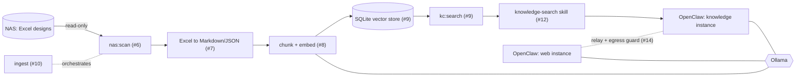

# Architecture

This repository builds a local, offline-capable knowledge cache for a
business project whose design documents live as Excel files on a NAS and
whose rules forbid sending NAS-derived information to a cloud LLM. A local
LLM (Ollama) driven by OpenClaw reads the cache to support automatic
coding. The overall goal and the work breakdown are tracked in
[#2](https://github.com/kurone-kito/oc-knowledge-cache/issues/2).

## Data flow

Everything between the NAS and the stores runs as `pnpm run` scripts in this
repository. The scripts are also the entry points that OpenClaw calls.

## Components

| Unit                              | Issue | Entry point                  |
| --------------------------------- | ----- | ---------------------------- |
| Test harness                      | #3    | `pnpm run test`              |
| Architecture and trust boundaries | #4    | this document                |
| Hardware detection, model choice  | #5    | `pnpm run models:recommend`  |
| NAS scan, incremental manifest    | #6    | `pnpm run nas:scan`          |
| Excel to Markdown and JSON        | #7    | used by `ingest`             |
| Chunking and embeddings           | #8    | used by `ingest`             |
| SQLite vector store, search       | #9    | `pnpm run kc:search`         |
| Sync the NAS into the cache       | #10   | `pnpm run ingest`            |
| Two OpenClaw profiles             | #11   | `pnpm run openclaw:generate` |
| OpenClaw skills                   | #12   | generated into profiles      |
| Idempotent provisioning           | #13   | `pnpm run provision`         |
| Relay and egress guard            | #14   | deferred                     |
| Vector index, hybrid search, MCP  | #15   | deferred                     |
| Excel shapes, grid paper, `.xls`  | #16   | deferred                     |

Source lives in `src/<module>/` with co-located `*.test.mts` files;
`src/cli/` holds the script entry points.

## Two instances, one repository

OpenClaw runs as two isolated profiles generated from this repository
(#11). Each profile has its own config file, state directory, workspace and
gateway port, so the configuration, state and files of one instance are not
overwritten by the other. They still share the host, the Ollama server and
(later) the relay, so a stronger separation than this needs operating-system
or network controls (#11 documents the limits of the generated profiles).

| Capability                  | `web` (research)  | `knowledge`                         |
| --------------------------- | ----------------- | ----------------------------------- |
| Internet (search, fetch)    | yes               | no, only through the relay (#14)    |
| NAS and the data directory  | no                | read-only                           |
| Knowledge cache search      | no                | yes                                 |
| Project repository          | no                | yes, as its workspace               |
| Shell commands (`exec`)     | no                | yes, in the project repository      |
| Control-plane tools         | denied            | denied                              |
| Model runtime               | local Ollama      | local Ollama                        |

The invariant to preserve: **NAS-derived content must never be sent to the
`web` instance or to any other Internet-facing service.** The `web` instance
has no access to the NAS, the data directory or the cache, so the only way
information can reach it is a question that the `knowledge` instance sends
through the relay. The egress guard (#14) therefore runs on the `knowledge`
side and rejects a request that matches fingerprints of the ingested corpus
**before** it leaves that instance. Until the relay and the guard exist (#14 is
deferred), no relay exists and the `knowledge` instance has no web access at
all.

## Information-flow rules

These rules cover every flow between an instance and the outside, today and
for features that come later. They add to the invariant above and do not
loosen it: **NAS-derived content itself is never sent to the web instance or
to any other Internet-facing service, with or without approval.** What rule 1
allows is something different, a text abstracted from private-origin
information, and only after a person has approved it. A query that the
knowledge instance would send through the relay of #14 is such a text when it
was abstracted from private-origin information, so the relay has to be
designed under rule 1: the egress guard of #14 keeps content out, and it does
not replace the approval.

1. **Private-origin information is never forwarded automatically to the
   public side, to GitHub or to a cloud LLM.** Private-origin means NAS
   documents, cache hits, internal requests and the contents of mail. Only an
   abstracted, public-safe text that was generated locally may leave, and
   only after a person has read and approved it. The content itself never
   leaves (the invariant above). A mask or a string-match filter can help the
   reader; it is never the gate.
2. **Public information flows to the private side in one direction only**, for
   example best practices that the web instance researched. The private side
   never puts internal details into a web query.
3. **A side effect of an automated flow needs an approval step.** Writing a
   ledger, sending mail and publishing are side effects. The approval has to
   come from something that the agent cannot do on its own behalf: in the
   research of #39 a model that held the approving tool approved a side effect
   because of a note inside the data it was shown.
4. **These rules do not replace the limits of the execution environment.** OS
   permissions and network routes are the real boundary, as the limits in
   [OpenClaw instances](openclaw.md#limits) say.

A skill or an adapter that touches one of these flows cites the rule it
relies on.

## Reuse before building

| Need                    | Choice                  | Custom code                     | If it outgrows                      |
| ----------------------- | ----------------------- | ------------------------------- | ----------------------------------- |
| Local LLM runtime       | Ollama                  | model recommendation            | none planned                        |
| Agent harness           | OpenClaw                | profile generator, skills       | none planned                        |
| Excel parsing           | ExcelJS                 | block detection, Markdown       | SheetJS or LibreOffice (#16)        |
| Embeddings              | Ollama `/api/embed`     | thin client                     | none planned                        |
| Non-volatile store      | `node:sqlite`           | brute-force cosine search       | sqlite-vec, LanceDB, Qdrant (#15)   |
| Tests                   | `node --test`, `tsc`    | none                            | none planned                        |

## Model selection

Models are never hard-coded. `models:recommend` (#5) reads the machine
(RAM, GPU memory) and the installed Ollama models (`/api/tags`,
`/api/show`), assigns each model a fit tier (`gpu`, `offload`, `cpu`) and
ranks the candidates per role (`agent` needs tool calling and a large
context; `embedding` needs the embedding capability). The profile generator
and the provisioning plan consume the same result.

## Data directory

Runtime state lives under `.data/` (git-ignored, override with `--data`):

- `manifest.json`: per-file `size`, `mtimeMs` and `sha256` of the last
  scan, which makes ingestion incremental.
- `store.sqlite`: documents, chunks, vectors and the embedding model name.

The generated OpenClaw profiles live in `.openclaw/` (also git-ignored),
deliberately outside the data directory so that the web instance's workspace
never sits next to the cache. See [OpenClaw instances](openclaw.md).

The NAS is only ever read. Ingestion and the `knowledge` instance need no
Internet once the models have been pulled; only the `web` instance needs it,
by design.

`ingest` is a host-side batch script run by a person or a scheduler, not a
tool of an OpenClaw agent. It is the only writer of `manifest.json` and
`store.sqlite`; the `knowledge` instance only runs `kc:search`, which opens
the store read-only, so the data directory can be shared with it read-only.
For that reason the store uses SQLite's default rollback journal instead of
WAL (WAL readers need a writable `-shm` file); a search may wait a few
milliseconds while a document is being replaced.
